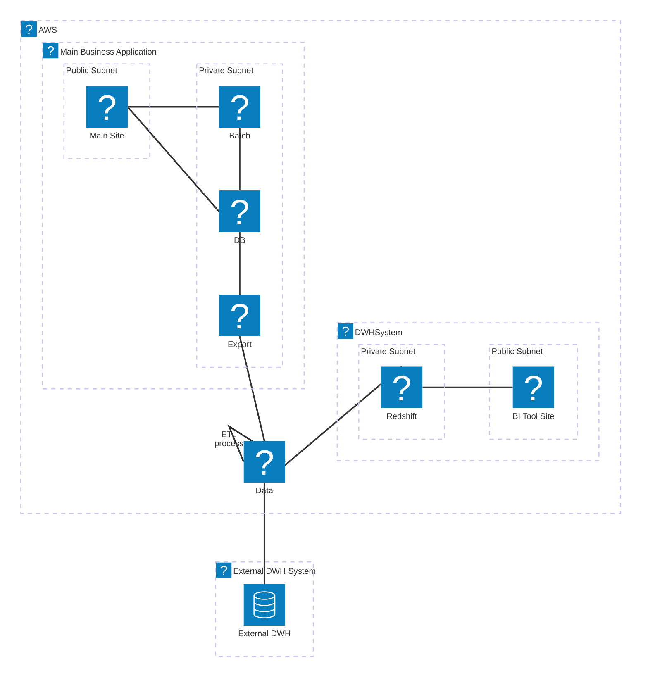

```mermaid

architecture-beta
group AWS(logos:aws)[AWS]
  group MBA(logos:aws-vpc)[Main Business Application] in AWS
    group publicsubnet[Public Subnet] in MBA
    group privatesubnet[Private Subnet] in MBA
    service web(logos:aws-ec2)[Main Site] in publicsubnet
    service db(logos:aws-aurora)[DB] in privatesubnet
    service batch(logos:aws-batch)[Batch] in privatesubnet
    service export(logos:aws-batch)[Export] in privatesubnet

  service s3(logos:aws-s3)[Data] in AWS

  group DWHSystem(logos:aws-vpc)[DWHSystem] in AWS
    group publicsubnet2[Public Subnet] in DWHSystem
      service web2(logos:aws-ec2)[BI Tool Site] in publicsubnet2

    group privatesubnet2[Private Subnet] in DWHSystem
      service redshift(logos:aws-redshift)[Redshift] in privatesubnet2
      

group ExternalDWHSystem(network)[External DWH System]
  service externaldwh(database)[External DWH] in ExternalDWHSystem

db:L -- R:web
batch:L -- R:web
db:T -- B:batch
export:T -- B:db
s3:T -- B:export
s3:L -[ETL process]- R:s3

redshift:T -- B:s3
redshift:R -- L:web2

externaldwh:T -- B:s3

```