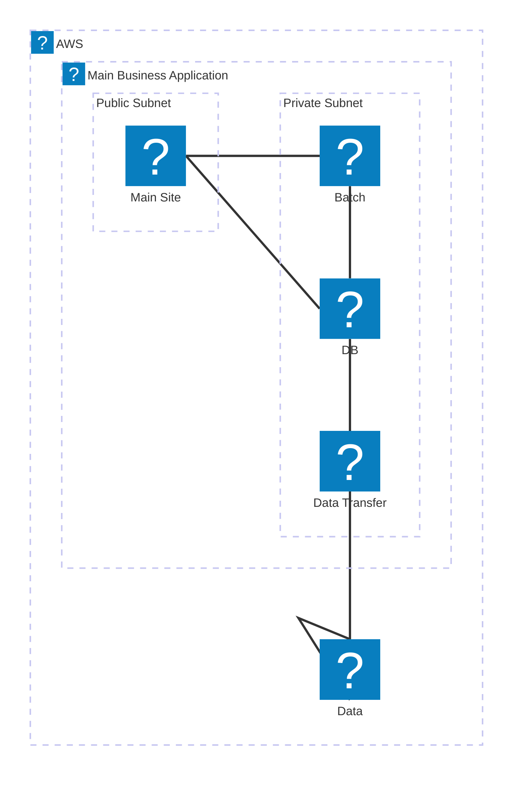

```mermaid

architecture-beta
group AWS(logos:aws)[AWS]
  group MBA(logos:aws-vpc)[Main Business Application] in AWS
    group PublicSubnet[Public Subnet] in MBA
    group PrivateSubnet[Private Subnet] in MBA
    service web(logos:aws-ec2)[Main Site] in PublicSubnet
    service db(logos:aws-aurora)[DB] in PrivateSubnet
    service batch(logos:aws-batch)[Batch] in PrivateSubnet
    service transfer(logos:aws-batch)[Data Transfer] in PrivateSubnet

  service S3(logos:aws-s3)[Data] in AWS

db:L -- R:web
batch:L -- R:web
db:T -- B:batch
transfer:T -- B:db
S3:T -- B:transfer
S3:T -- B:S3

```