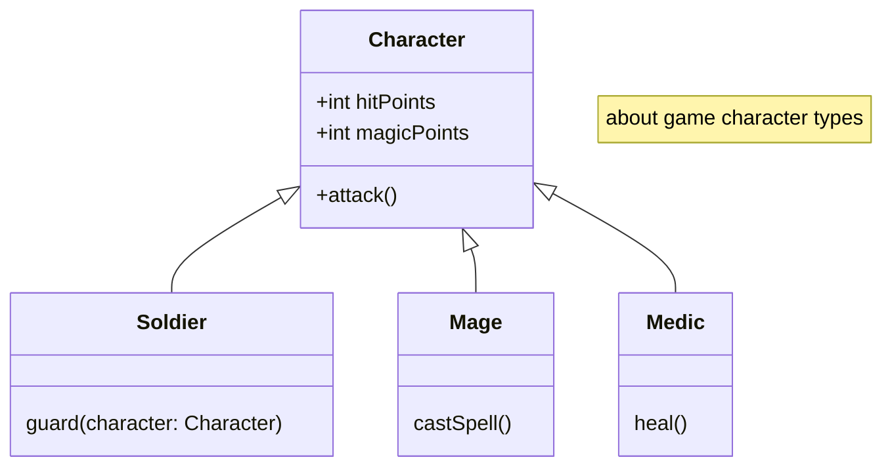

```mermaid
classDiagram
    direction TD
    note "about game character types"
    Character: +int hitPoints
    Character: +int magicPoints
    Character: +attack()
    subgraph subClasses
        Soldier
        Mage
        Medic
    end
    Character <|-- Soldier
    Character <|-- Mage
    Character <|-- Medic
    class Soldier {
        guard(character: Character)
    }
    class Mage {
        castSpell()
    }
    class Medic {
        heal()
    }
```
