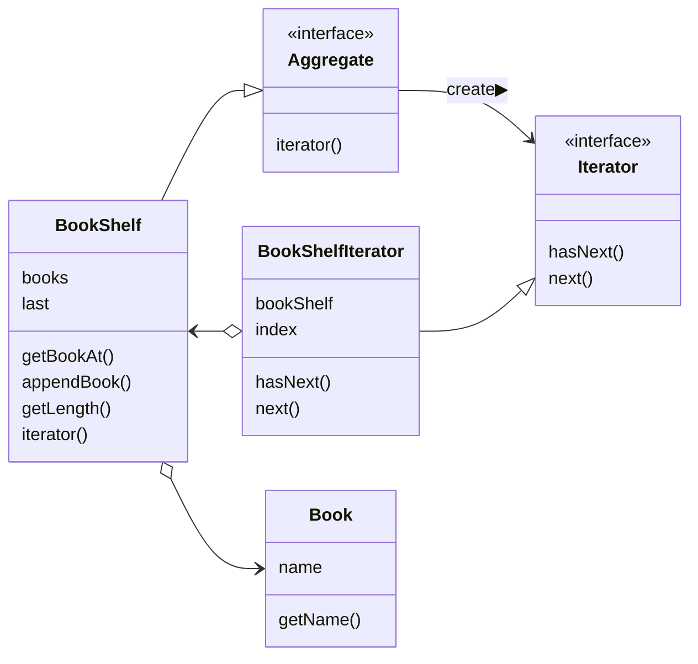

```mermaid
classDiagram

class Aggregate {
    <<interface>>
    iterator()
}

class Iterator {
    <<interface>>
    hasNext()
    next()
}

class BookShelf {
    books
    last
    getBookAt()
    appendBook()
    getLength()
    iterator()
}

class BookShelfIterator {
    bookShelf
    index
    hasNext()
    next()
}

class Book {
    name
    getName()
}


direction LR
Aggregate --> Iterator : create▶︎
BookShelf <--o BookShelfIterator

BookShelf --|> Aggregate
BookShelfIterator --|> Iterator
BookShelf o--> Book

```