# Text-to-SQL

---

目次
- Text-To-SQLとは?
- Text-to-SQLの進化
- LLMを使ったText-to-SQLの3つの観点
- LLMを使った手法の大分類
- 文脈内学習に属する各種手法
- 私見
- 参考文献

---

## Text-to-SQLとは?

  

    自然言語(日常で使う言語)による質問をデータベースで実行可能なSQLに変更するタスク。 
    スキルのないユーザでもプロのようなデータのアクセスや素早い試行錯誤を行えるようにする。 
    また最近では、裏付けとなるデータを与えてLLMのハルシネーション(事実と異なることを事実であるかのように述べること)を防ぐ用途に使うことも考えられている。
    
  

  

    </img>
  

---

## Text-to-SQLの進化

ものすごくざっくり分けると、  
1. ルールベースの手法
2. ディープラーニングを使う手法
となる。  

特に最近ではLLMを使った手法が研究されている。

---

## LLMを使ったText-to-SQLの3つの観点

1. 質問の理解
   ユーザの質問の意味が理解できているか。最終的に作成されたSQLがユーザの意図に沿うかどうかに関わる。
2. スキーマの理解
   データベースのテーブルや列の構造の理解。ユーザの質問に答える為に必要なテーブルや列を定められるかどうかに関わる。
3. SQLの生成
   上記の要素を組み合わせて必要とされる答えを返す、実行可能なSQLクエリを生成する。

---

## LLMを使った手法の大分類

大きく分けて下記の2つに分けられる。
1. 文脈内学習(ICL: In Context Learning)
   与える入力文によってLLMにタスクの前提や内容を理解させて精度を高めていく手法。
   いわゆるプロンプトエンジニアリングを行う。
2. ファインチューニング(FT: Fine Tuning)
   あるモデルをベースにして、Text-to-SQLに特化させるように訓練を行う。  

この資料では文脈内学習を中心に詳細を説明する。

---

## 文脈内学習に属する各種手法
### Zero-shot
特に例などは与えず、指示文、ユーザ質問、スキーマをそのまま渡す。
(冒頭の図では、上記の中のユーザ質問とスキーマしかなかったが、「以下の質問に回答してください。」という文言を指示文として先頭に与えればこれに該当する。) 

---

### Few-shot
タスクをこなす手掛かりの例を与えてより精度の高い回答を行えるようにする。
例としては質問、スキーマ、回答SQLの組を与える。
(トークン数削減の為にスキーマを省く場合もあるが、現在のLLMのトークン数ならばあまり気にしなくても良いはず?)
与える例については後述するようにユーザ質問によって適宜変えることもある。

---

### Decomposition
手順をより簡単な複数の手順に分解して、複雑なSQL文を一気に作成するときの複雑性を解消する。
- タスクの分解(テーブルの選択、結合の決定、ドメイン分類(データ型、値の範囲の決定、カテゴリの識別等、WHERE句の内容などの作成?)、etc...)
- ユーザ質問の分解
のような分解が挙げられる。

---

### Prompt Optimazation
ユーザの質問に応じてプロンプト自体を動的に最適化する。
特に先述のFew-shotでは例の選択方法の戦略が最適化の対象となり、
- 質問の意味の類似度を見る
- 回答SQLの類似度を見る
  (ただし、ユーザの質問への回答SQLは予め用意できないので、仮回答のSQLを作成して比較)
- ドメイン特有の項目をマスクして構造に着目する。  

などいろんな例の選び方が考えられている。  

---

他にもスキーマ情報提示の戦略
- テーブルと列名を単に列挙するか
- 外部キーの情報を明示するか
- CREATE TABLE文の定義をそのまま渡すか

や外部知識提示の戦略なども考えられる。

---

### Reasoning Enhancement
ユーザの質問に対して理由付けを行ってタスクをこなすことで精度を上げる。

- CoT(Chain-of-Thought、思考の連鎖)
  - Zero-shot CoT(「ステップバイステップで考えてください」)
- PoT(Program-of-Thought)
  LLMが苦手な計算関連のタスクを強化する。Pythonコードの処理などと組み合わせる。

などが挙げられる。

---

### Execution Refinement
1度生成されたSQL文を実行して、その結果を元にSQL文を改善していく。

---

## 私見
- はっきり言って、Text-to-SQLのプロンプトエンジニアリングは「後輩にSQL文作成の依頼をするときにどんな情報を与えるか」ということではないか。そういう観点で見れば各種手法の意味合いも理解しやすいのではないか。SQLについて教育する側される側の双方にとっての示唆を得られるのではないか。  
- LLMに与える情報として各種コード値の対応表(ex. 1. Male, 2: Female)なども必要だと思われる。  
- ベンチマークのデータセットはまだ見れていないので、なるべく実務寄り?のSpider-Realisticデータセットを確認して実務との隔たりを確認したい。  
- AI Friendlyなテーブル定義などがあるのだろうか、DWHのスタースキーマなどはSQLの自動生成に向いているのかなど有識者に聞いてみたい。  

--- 

- セキュリティについての問題は無視できない。更新権限のないユーザを用意したり、機密事項(パスワード)を除いたビューのみにアクセスできるようにしたりするのは当然とした上で、それ以外に行うべき考慮を有識者に確認したい。  
- SQL作成の難易度やセキュリティの問題などを考慮して、使うテーブルを制限して抽出条件(WHERE句)の作成に特化させるようなことが考えられる。  
  あるいは直接SQLを作るのではなく、パラメータがものすごく多いけれどもあまり使いこなせないデータ取得APIの入力補助などに使うという形にすれば危険性は少なくなる。  
- 論文、研究での汎用的な性能測定の観点から、ドメイン特有の事項をマスクするのは分からなくはないが、実務上ではドメイン特有の事項をマスクせずに残した方が実用性が高いのではないか。(本当にSQLの構造自体に着目したい場合はその限りではないが。)  
- ユーザに同意をとって質問を記録し、どのようにデータを見たいかなどのニーズを把握して開発に活かすサイクルができると望ましい。

---

## 参考文献
- Next-Generation Database Interfaces: A Survey of LLM-based Text-to-SQL v3(Zijin Hong, Zheng Yuan, Qinggang Zhang, Hao Chen, Junnan Dong, Feiran Huang, Xiao Huang)
https://arxiv.org/abs/2406.08426

- Text-to-SQL Empowered by Large Language Models: A Benchmark Evaluation v4(Dawei Gao, Haibin Wang, Yaliang Li, Xiuyu Sun, Yichen Qian, Bolin Ding, Jingren Zhou)
https://arxiv.org/abs/2308.15363  